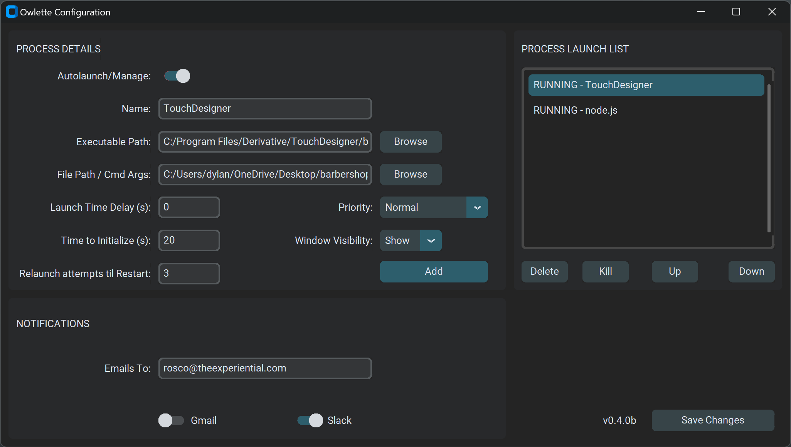

# 🦉 Owlette

Owlette is a Python-based Windows process watcher service designed for maximum flexibility and editability. 🛠️ It manages and monitors various processes and system metrics, automatically restarting applications if they crash or are accidentally closed. 🔄 It can also send email and/or Slack notifications when certain events occur. 📧

## 📚 Table of Contents

1. [🌟 Features](#features)
2. [🛠️ Installation](#installation)
3. [🚀 Usage](#usage)
4. [🎛️ UI Features](#ui-features)
5. [🛠️ Configuration](#configuration)
6. [🗑️ Uninstallation](#uninstallation)
7. [🐞 Troubleshooting](#troubleshooting)
8. [🤝 Contributing](#contributing)
9. [📜 License](#license)

## 🌟 Features

- 🚀 Starts specified processes upon system startup
- 🔄 Automatically restarts applications if they crash or are accidentally closed
- 📊 Monitors system metrics like CPU usage, memory usage, and disk space
- 📧 Sends email/Slack notifications using Gmail/Slack APIs
- 🍽️ Tray icon for easy access to features and settings
- 🎚️ Autolaunch Process Toggle: Conveniently disable a process from automatically launching during development
- 🔄 Relaunch Attempts til Restart: Configurable number of relaunch attempts before triggering a system restart

## 🛠️ Installation

### 📋 Prerequisites

- 🐍 Python 3.9 or higher
- 📦 pip (Python package installer)
- ☁️ Google Cloud Platform (GCP) account for Gmail API

1️⃣ Clone the repository:

    
    git clone https://github.com/theexperiential/Owlette.git
    

2️⃣ Navigate to the project directory:

    
    cd Owlette
    

### 📦 Installation Methods

#### 🤖 Automatic Installation/Updater

Run the `install.bat` file as an administrator to automatically install the required packages and set up the service. It also works as an updater, anytime this repo is updated.

#### 🖐️ Manual Installation

1. Install the required Python packages:

    
    pip install -r requirements.txt
    

2. Create folders named `config`, `logs`, and `tmp` in the `Owlette` folder.

### ☁️ Gmail API Configuration (Google Cloud Platform)

1️⃣ Go to the [Google Cloud Console](https://console.developers.google.com/).
2️⃣ Create a new project.
3️⃣ Navigate to "APIs & Services" > "Dashboard".
4️⃣ Enable the Gmail API.
5️⃣ Create OAuth client IDs and download the client secrets JSON file.
6️⃣ Place the downloaded JSON file in the project `config` directory and rename it to `client_secrets.json`.

### 🤖 Slack API Configuration

#### 🛠️ Part 1: Create Your Slack App 

1. Head over to the [Slack API website](https://api.slack.com/).
2. Click on "Create an App" and fill in your App Name and Development Slack Workspace.

#### 🛡️ Part 2: OAuth & Permissions 

1. Once your app is up and running, navigate to the "OAuth & Permissions" page.
2. Under "Bot Token Scopes," add the following scopes:
    - `channels:write`
    - `channels:manage`
    - `chat:write`

#### 🚀 Part 3: Install the App 

1. Scroll back to the top of the "OAuth & Permissions" page.
2. Hit that "Install App to Workspace" button.
3. Review the permissions and click "Allow."

#### Part 4: Enable Slack & Enter OAuth Token

1. Enable the Slack toggle in Owlette Configuration.
2. Enter your Bot User OAuth Token (from OAuth & Permissions page) and click on "Submit".
3. Check your Slack workspace in the `#owlette` channel for a message from Owlette!

## 🚀 Usage

1️⃣ Run the `owlette_gui.py` script to configure the service:

    
    python owlette_gui.py
    

2️⃣ Follow the on-screen instructions to authenticate with Gmail and configure the processes you want to manage.

3️⃣ To install the Windows service, run the following command as an administrator:

    
    python owlette_service.py install
    

4️⃣ To start the Windows service, run:

    
    python owlette_service.py start
    

5️⃣ To stop the Windows service, run:

    
    python owlette_service.py stop
    

6️⃣ The tray icon will automatically run with the service. But if you wish to run the GUI configuration, just double-click on `owlette_gui.py` or run:

    
    python owlette_gui.py
    

7️⃣ To restart the system tray icon, restart the process or run:

    
    python owlette_tray.py
    

## 🎛️ UI Features

### System Tray Icon

#### Right-Click Menu

- **Open Config**: Brings up the Owlette Configuration window where you can manage and monitor processes. 
- **Start on Login**: Allows you to toggle whether the service starts upon system login.
- **Exit**: Closes the Owlette service and any open Configuration windows.

## 🛠️ Configuration

### 📑 Overview

The Configuration UI is built using the customtkinter library and is designed to manage processes and notifications. It features a dark theme and provides various functionalities like adding, removing, and reordering processes, as well as configuring email settings.

### 🧩 UI Components

#### 🔄 Process Details

- **Name**: Text field to enter the name of the process.
- **Exe Path**: Text field to specify the executable path. Includes a "Browse" button.
- **File Path / Cmd Line Args**: Text field for additional file paths or command-line arguments. Includes a "Browse" button.
- **Launch Time Delay (s)**: Text field to specify a time delay, in seconds, before the process starts.
- **Time to Initialize (s)**: Text field to specify the total time, in seconds, to give a process to fully initialize before checking it's responsitivity.
- **Autolaunch Process**: Enable or disable monitoring for the selected process. If enabled, Owlette will check the process every 10 seconds. If it is unresponsive, it will attempt to close and relaunch it. If the process ID (PID) is no longer found, Owlette will attempt to relaunch it automatically.
- **Relaunch Attempts til Restart**: Set the number of relaunch attempts before a system restart is triggered. Owlette will prompt you with a 30 second countdown window before starting, which you may either initiate, pause or cancel. If the countdown completes, the restart will continue.
- **Add Process**: Adds a new process to the Process Startup List based on the details provided.

#### 📋 Process Startup List

- **Listbox**: Displays the list of configured processes. The list is ordered, so your processes will be started in the order you define.
- **Up**: Move the selected process up in the list (start it before other processes).
- **Down**: Move the selected process down in the list (start it after other processes).
- **Del**: Remove the selected process from the list.
- **Save Changes**: Save any modifications to the selected process and Alerts section.

#### 📧 Email Alerts

- **Emails To (Comma Separated)**: Text field to specify the recipient email addresses, separated by commas.
- **Gmail**: Toggle to initiate (or disable) Gmail email notifications.
- **Slack**: Toggle to initiate (or disable) Slack notifications.

### 🌟 Features

- **Dark Theme**: The UI uses a dark color scheme for better visibility.
- **Validation**: Includes validation for duplicate process names, invalid paths, and invalid email addresses.
- **Keyboard Shortcuts**: The Return key can be used to update process and email configurations.

### ⚙️ Additional Functionalities

- **Google OAuth**: Includes a function to get Google OAuth tokens for Gmail.
- **JSON Configuration**: Utilizes a JSON file (`config.json`) to load and save configurations.

## 🗑️ Uninstallation 

To uninstall the Owlette service and python dependencies, you may run the `uninstall.bat` file as an administrator. Alternatively, to just remove the service, you may run the following command as an administrator:

    
    python owlette_service.py remove
    

This will remove the Owlette service from your system.

## 🐞 Troubleshooting

### 📝 Logs 
Logs are stored in the `logs` folder, per script. `service.log` for the service, `email.log` for the email sender, `tray.log` for the tray icon, etc. Check these logs for debugging information.

### 🔄 Restarting the service
If you exit Owlette from the tray icon or stop the service and wish to restart it, you can go to Services (`services.msc` from the run menu), and find the "Owlette Service" and click on "Start the service", or run the following command as an administrator:

    
    python owlette_service.py start
    

## 🤝 Contributing

Feel free to contribute by submitting pull requests.

## 📜 License

This project is licensed under the GNU General Public License v3.0.
