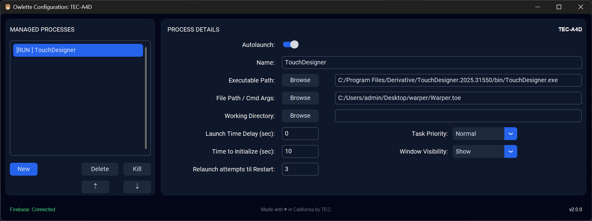
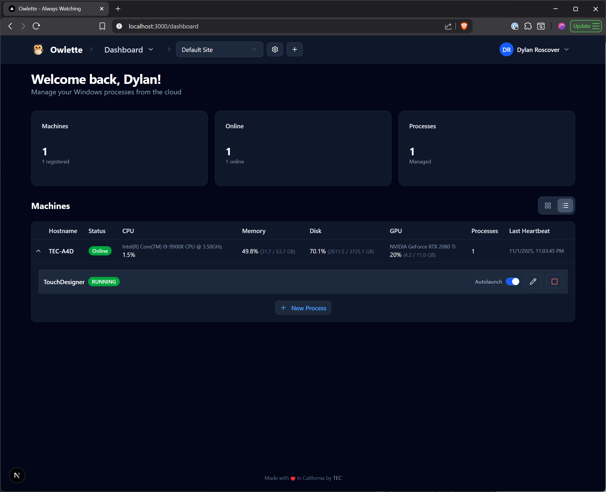

# 🦉 Owlette

<div align="center">

</div>

### _Cloud-Connected Process Management & Remote Deployment System_

**Version 2.0.0** - A modern, cloud-connected process management system for Windows that combines:

- 🖥️ **Windows Service** - Monitors and auto-restarts applications
- 🌐 **Web Dashboard** - Real-time monitoring and control from anywhere
- 🚀 **Remote Deployment** - Install software across multiple machines
- 📊 **Live Metrics** - CPU, memory, disk, and GPU tracking
- 🔄 **Firebase Sync** - Bidirectional cloud communication
- 🏢 **Multi-Site Management** - Manage machines across multiple locations

Perfect for managing TouchDesigner installations, digital signage, kiosks, media servers, and any Windows application fleet.

<div align="center">

<p><em>Owlette Agent - Windows system tray application for local process management</em></p>
</div>

<br />

<div align="center">

<p><em>Owlette Dashboard - Web-based control panel for remote machine monitoring</em></p>
</div>
<br />

## 📚 Table of Contents

1. [🌟 Features](#features)
2. [🛠️ Installation](#installation)
   - [Agent (Windows Service)](#agent-installation)
   - [Web Dashboard](#web-dashboard-setup)
3. [🌐 Web Dashboard](#web-dashboard)
4. [🚀 Remote Deployment](#remote-deployment)
5. [📦 Project Distribution](#project-distribution)
6. [🚀 Usage](#usage)
7. [🎛️ UI Features](#ui-features)
8. [🛠️ Configuration](#configuration)
9. [🗑️ Uninstallation](#uninstallation)
10. [🐞 Troubleshooting](#troubleshooting)
11. [🤝 Contributing](#contributing)
12. [📜 License](#license)

<a id="features"></a>
## 🌟 Features

### 🌐 Cloud & Remote Management
- **Web Dashboard** - Modern Next.js dashboard for monitoring and control from anywhere
- **Real-Time Sync** - Bidirectional Firebase/Firestore synchronization
- **Multi-Machine Management** - Control multiple Windows machines from one interface
- **Multi-Site Support** - Organize machines across different locations/installations
- **Multi-User Access** - Secure user accounts with role-based permissions
- **Site Access Control** - Admins assign site access; users see only their assigned sites
- **Remote Software Deployment** - Install applications silently across multiple machines
- **Project File Distribution** - Sync project files (ZIPs, .toe files) across your fleet
- **Live Metrics Dashboard** - Real-time CPU, memory, disk, and GPU monitoring

### 🖥️ Windows Service (Agent)
- **Auto-Start Processes** - Launch applications automatically on system boot
- **Crash Recovery** - Automatically restart applications if they freeze or crash
- **Process Monitoring** - Real-time status tracking and responsiveness checking
- **PID Recovery** - Reconnect to existing processes after service restart
- **Priority Control** - Set process priority (Low, Normal, High, Realtime)
- **Visibility Control** - Show or hide process windows
- **Configurable Retries** - Set relaunch attempts before system restart

### 🎛️ Configuration & Control
- **System Tray Icon** - Quick access to features and service control
- **Configuration GUI** - Easy-to-use Windows application for setup
- **Web-Based Config** - Edit process settings from the dashboard
- **Autolaunch Toggle** - Enable/disable processes without editing config
- **Instant Sync** - Changes sync between GUI, service, and web in ~1-2 seconds

### 🚀 Advanced Features
- **Silent Deployment** - Install software with automatic silent flags detection
- **Deployment Templates** - Save and reuse installer configurations
- **Deployment Cancellation** - Stop installations remotely
- **Installation Verification** - Confirm successful deployments
- **Project Distribution** - Distribute project files with ZIP extraction and verification
- **URL-Based Distribution** - Zero infrastructure cost using your own file hosting
- **Offline Mode** - Agent continues working even if cloud disconnects
- **Comprehensive Logging** - Detailed logs for troubleshooting

<a id="installation"></a>

## 🛠️ Installation

Owlette consists of two components:
1. **Agent** - Windows service running on each managed machine
2. **Web Dashboard** - Next.js web application for remote management

### 📋 Prerequisites

**For Agent (Windows Service):**
- 🐍 Python 3.9 or higher
- 📦 pip (Python package installer)
- 🔥 Firebase project with Firestore enabled (see [Firebase Setup Guide](docs/firebase-setup.md))

**For Web Dashboard:**
- 🟢 Node.js 18.x or higher
- 🔥 Same Firebase project as agent

**Quick Start:**
```bash
# Clone the repository
git clone https://github.com/theexperiential/Owlette.git
cd Owlette
```

<a id="agent-installation"></a>
### 🖥️ Agent (Windows Service) Installation

### 📦 Installation Methods

#### 🤖 Automatic Installation/Updater

Run the `agent\install.bat` file to automatically install the required packages and set up the service.

```bash
cd agent
install.bat
```

#### 🖐️ Manual Installation

1. Install the required Python packages:

    ```bash
    cd agent
    pip install -r requirements.txt
    ```

2. Create folders named `config`, `logs`, and `tmp` in the `agent` folder.

3. **Configure Firebase:**
   - Follow the comprehensive [Firebase Setup Guide](docs/firebase-setup.md)
   - Place your `firebase-credentials.json` in `agent/config/`
   - Update `agent/config/config.json` with your site ID

<a id="web-dashboard-setup"></a>
### 🌐 Web Dashboard Installation

See the full [Web Dashboard README](web/README.md) for detailed instructions.

**Quick Setup:**
```bash
cd web
npm install

# Configure environment variables
cp .env.example .env.local
# Edit .env.local with your Firebase config

# Development
npm run dev
# Access at http://localhost:3000

# Production
npm run build
npm start
```

**Firebase Configuration:**
The web dashboard uses the same Firebase project as the agent. See [Firebase Setup Guide](docs/firebase-setup.md) for details.

**Deployment:**
Deploy to Railway, Vercel, or any Node.js hosting platform. See [web/README.md](web/README.md) for platform-specific instructions.

---

<a id="web-dashboard"></a>
## 🌐 Web Dashboard

The Owlette web dashboard provides a modern interface for managing all your machines from anywhere.

### Features

**Machine Monitoring:**
- Real-time status of all managed machines
- Live system metrics (CPU, memory, disk, GPU)
- Process status and health monitoring
- Connection status and last heartbeat

**Process Management:**
- Start/stop processes remotely
- Edit process configuration from web
- Toggle autolaunch for any process
- View process runtime information

**Multi-Site Organization:**
- Create multiple sites (locations/installations)
- Organize machines by site
- Switch between sites instantly
- Site-level management and permissions

**Dashboard Views:**
- Card view for overview
- List view for detailed information
- Collapsible machine details
- Real-time updates via Firebase listeners

### Accessing the Dashboard

1. **Locally:** `http://localhost:3000` after running `npm run dev`
2. **Production:** Your deployed URL (e.g., Railway, Vercel)
3. **Authentication:** Email + Password or Google OAuth

### Managing Machines

Machines automatically appear in the dashboard when the agent connects to Firebase. No manual registration required!

---

<a id="remote-deployment"></a>
## 🚀 Remote Deployment

Deploy software silently across multiple machines from the web dashboard.

### Features

- **Silent Installation** - Unattended software deployment
- **Multi-Machine Targets** - Deploy to one or many machines at once
- **Deployment Templates** - Save configurations for reuse
- **Real-Time Progress** - Watch installations as they happen
- **Cancellation** - Stop in-progress installations
- **Verification** - Confirm successful deployment

### Usage

1. Navigate to the **Deploy Software** section in the web dashboard
2. Create a new deployment or use a template
3. Configure:
   - Installer URL (direct download link)
   - Silent flags (e.g., `/S`, `/VERYSILENT`)
   - Optional verification path
4. Select target machines
5. Deploy!

### Supported Installers

Works with any installer that supports silent/unattended mode:
- ✅ NSIS installers (`/S`)
- ✅ InnoSetup (`/VERYSILENT /SUPPRESSMSGBOXES`)
- ✅ MSI packages (`/quiet /norestart`)
- ✅ Custom installers (specify your own flags)

**Examples:**
- TouchDesigner: `/S`
- Notepad++: `/S`
- Chrome: `/silent /install`

See the [Deployment Guide](docs/deployment.md) for detailed setup and examples.

---

<a id="project-distribution"></a>
## 📦 Project Distribution

Distribute project files (ZIPs, TouchDesigner .toe files, media assets) across multiple machines.

### Features

- **URL-Based Distribution** - Zero infrastructure cost - paste any URL (Dropbox, Google Drive, your hosting)
- **Automatic Extraction** - Downloads and extracts ZIP files to specified location
- **Real-Time Progress** - Watch download and extraction progress per machine
- **File Verification** - Confirm critical files exist after extraction
- **Distribution Templates** - Save common project configurations
- **Default Location** - Files extract to `~/Documents/OwletteProjects` by default

### Usage

1. Navigate to **Distribute Projects** in the web dashboard
2. Create a new distribution:
   - **Name**: "Summer Show 2024"
   - **Project URL**: Direct download link to your ZIP (Dropbox, Drive, etc.)
   - **Extract To**: Optional custom path (default: `~/Documents/OwletteProjects`)
   - **Verify Files**: Optional comma-separated list of critical files to check (e.g., `project.toe, Assets/`)
3. Select target machines
4. Distribute!

### Perfect For

- TouchDesigner project distribution (.toe files + media)
- Digital signage content updates
- Multi-GB project files with assets
- Syncing configurations across machines

### Cost-Effective Architecture

**Zero Owlette Infrastructure Costs:**
- Users host files on their own service (Dropbox, Google Drive, Backblaze, etc.)
- Machines download directly from provided URL
- Only Firestore operations are used (~$0.0001 per distribution)

See the [Project Distribution Guide](docs/project-distribution.md) for detailed setup and examples.

---

<a id="usage"></a>
## 🚀 Usage

1️⃣ Run the `owlette_gui.py` script to configure the service:

    ```bash
    cd agent\src
    python owlette_gui.py
    ```

2️⃣ Follow the on-screen instructions to authenticate with Gmail and configure the processes you want to manage.

3️⃣ To install the Windows service, run the following command as an administrator:

    ```bash
    cd agent\src
    python owlette_service.py install
    ```

4️⃣ To start the Windows service, run:

    ```bash
    cd agent\src
    python owlette_service.py start
    ```

5️⃣ To stop the Windows service, run:

    ```bash
    cd agent\src
    python owlette_service.py stop
    ```

6️⃣ The tray icon will automatically run with the service. But if you wish to run the GUI configuration, just double-click on `agent\src\owlette_gui.py` or run:

    ```bash
    cd agent\src
    python owlette_gui.py
    ```

7️⃣ To restart the system tray icon, restart the process or run:

    ```bash
    cd agent\src
    python owlette_tray.py
    ```
    

<a id="ui-features"></a>
## 🎛️ UI Features

### System Tray Icon

#### Right-Click Menu

- **Open Config**: Brings up the Owlette Configuration window where you can manage and monitor processes. 
- **Start on Login**: Allows you to toggle whether the service starts upon system login.
- **Restart**: Restarts the Owlette service.
- **Exit**: Closes the Owlette service and any open Configuration windows.

<a id="configuration"></a>
## 🛠️ Configuration

### 📑 Overview

The Configuration UI is built using the customtkinter library and is designed to manage processes and notifications. It features a dark theme and provides various functionalities like adding, removing, and reordering processes, as well as configuring email settings.

### 🧩 UI Components

#### 🔄 Process Details

- **Autolaunch/Manage**: Enables or disables monitoring for the selected process. If enabled, Owlette will check the process every 10 seconds. If it is unresponsive, it will attempt to close and relaunch it. If the process ID (PID) is no longer found, Owlette will attempt to relaunch it automatically.
- **Name**: Text field to enter the name of the process.
- **Exe Path**: Text field to specify the executable path. Includes a "Browse" button.
- **File Path / Cmd Line Args**: Text field for additional file paths or command-line arguments. Includes a "Browse" button.
- **Launch Time Delay (s)**: Text field to specify a time delay, in seconds, before the process starts.
- **Time to Initialize (s)**: Text field to specify the total time, in seconds, to give a process to fully initialize before checking it's responsitivity.
- **Relaunch Attempts til Restart**: Set the number of relaunch attempts before a system restart is triggered. Owlette will prompt you with a 30 second countdown window before starting, which you may either initiate, pause or cancel. If the countdown completes, the restart will continue.
- **Priority**: Dropdown menu to set the priority level of the process (how much CPU time the process gets compared to other running processes).
- **Window Visibility**: Dropdown menu to set the process window to be shown or hidden.
- **Add**: Adds a new process to the Process Startup List based on the details provided.

#### 📋 Process Startup List

- **Listbox**: Displays the list of configured processes. The list is ordered, so your processes will be started in the order you define.
- **Kill**: Terminates the selected and running process.
- **Del**: Removes the selected process from the list.
- **Up**: Moves the selected process up in the list (start it before other processes).
- **Down**: Moves the selected process down in the list (start it after other processes).
- **Save Changes**: Saves any modifications to the selected process and Notifications section. Note that changes are also saved when you press your return key on your keyboard in a text field, or click anywhere outside of one in the UI.

<a id="uninstallation"></a>
## 🗑️ Uninstallation

To uninstall the Owlette service and python dependencies, you may run `agent\uninstall.bat`:

```bash
cd agent
uninstall.bat
```

Alternatively, to just remove the service, you may run the following command as an administrator:

    ```bash
    cd agent\src
    python owlette_service.py remove
    ```

This will remove the Owlette service from your system.

<a id="troubleshooting"></a>
## 🐞 Troubleshooting

### 📝 Logs 
Logs are stored in the `logs` folder, per script. `service.log` for the service, `email.log` for the email sender, `tray.log` for the tray icon, etc. Check these logs for debugging information.
    
<a id="contributing"></a>
## 🤝 Contributing

Feel free to contribute by submitting pull requests.

<a id="license"></a>
## 📜 License

This project is licensed under the GNU General Public License v3.0.
