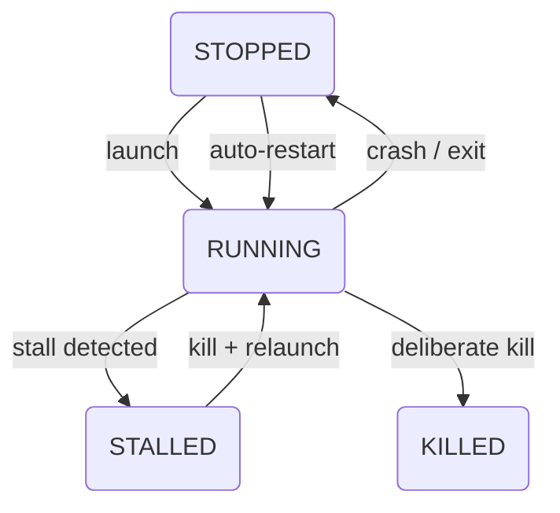

---

## process state machine

The agent reports these process statuses. This diagram shows the common managed-process path. A crash never produces `KILLED` — the service writes no status and logs a `process_crash` event, and once the dead PID is swept out of `app_states.json` the process reports `STOPPED` (launch mode active) or `INACTIVE` (launch mode `off`):


```mermaid
flowchart TD
    STOPPED("STOPPED") -->|launch| RUNNING("RUNNING")
    RUNNING -->|crash / exit| STOPPED
    RUNNING -->|stall detected| STALLED("STALLED")
    RUNNING -->|deliberate kill| KILLED("KILLED")
    STOPPED -->|auto-restart| RUNNING
    STALLED -->|kill + relaunch| RUNNING
```

### state definitions

| state | description | dashboard indicator |
|-------|-------------|---------------------|
| **RUNNING** | Process is alive and responsive | Green |
| **LAUNCHING** | Launch is in progress | Yellow |
| **RESTARTING** | Operator-initiated restart in flight — written by the desktop app before it terminates the PID, so the exit is logged as `process_restarted` rather than raising a crash alert | Yellow |
| **QUEUED** | Launch is queued or waiting for a delay | Yellow |
| **LAUNCH_FAILED** | The executable could not be resolved, a launch failed, or an operation was refused because the process could not be verified as owlette's. Clears on the next successful launch | Red |
| **STALLED** | Process exists but is not responding (hang detected) | Yellow |
| **KILLED** | Process was deliberately terminated — from the local app, the dashboard, or by the agent before a stall relaunch. The marker only tells the service the exit was intended, so no crash alert is raised; whether the process comes back is decided by its launch mode. The exception is a kill sent from the dashboard, which is not relaunched until an operator starts it or its launch mode is set again | Red |
| **STOPPED** | Launch mode is active, but no running PID/runtime data is present | Red |
| **INACTIVE** | Launch mode is `off` and no PID/runtime data is present — an off-mode process that is still running keeps reporting `RUNNING` | Slate/grey |

The desktop app draws the same states as dots beside each process in the sidebar — filled for a process that is up, a hollow ring for one that is not:


---

## monitoring loop

Every 5 seconds, the agent runs through all configured processes:

### 1. check if process is running

The monitoring loop validates the process by:

1. **PID check** — Is there a process with the stored PID?
2. **Status update** — Keep it RUNNING when the PID is live, or treat a disappeared PID as an unexpected stop when launch mode is still active.

PID recovery re-adopts a PID only when the identity recorded at launch — the PID plus the process's creation time — still matches the live process, which rules out PID-reuse false positives during startup recovery.

### 2. crash detection

A process is considered unexpectedly stopped when:

- Its stored PID no longer exists.
- Launch mode is still active, so the agent can relaunch it within the configured restart budget.

### 3. hang detection (multi-stage)

The agent uses a progressive approach to detect frozen applications:

| stage | time | action |
|-------|------|--------|
| **Startup grace** | First 60s after launch | Skip responsiveness checks |
| **Probe** | Every ~5s after grace | `owlette_scout.py` enumerates windows for the PID and uses `IsHungAppWindow` |
| **Monitor** | Before 15s | Mark the process as STALLED, but keep waiting through repeated 5-second checks |
| **Confirmation** | 15s+ | If the process has stayed unresponsive for `HANG_CONFIRM_SECONDS`, kill and relaunch it |

The agent does not kill on the first failed responsiveness check; it waits until the process has been unresponsive for 15 seconds after the startup grace period.

### 4. auto-restart

When a crash is detected and launch mode is active:

1. Agent increments the **relaunch counter**
2. If under the limit (`relaunch_attempts`), restart the process
3. Wait `time_delay` seconds before starting
4. Wait `time_to_init` seconds before monitoring responsiveness
5. If at the limit, show a **reboot prompt** to the user

If PID detection fails after launch, retry attempts wait for at least `time_to_init`, with a 60-second minimum cooldown for slow-starting applications.

If the configured `exe_path` does not exist, the agent does not attempt to launch the process. On the transition into that failed state, it scans nearby sibling directories for executable paths with the same basename, sends an `exe_missing` alert with suggested paths, and writes a `process_launch_failed` log event. The alert is rate-limited by the same failed-launch marker so it does not repeat every monitoring tick. The entry's status is also written as `LAUNCH_FAILED`, so the failure shows red in the desktop app and on the dashboard rather than living only in the log. The one exception is an entry that has never launched at all: it has no status row to carry the mark and stays inactive, with the log and the command result as the only signals.

---

## process launch methods

Managed process launch uses `CreateProcessAsUser` to start `process_launcher.py` in the logged-in user session:

```
Agent gets user token (WTSQueryUserToken)
    → CreateProcessAsUser starts process_launcher.py
    → process_launcher.py uses ShellExecuteEx for visible windows
    → process_launcher.py uses subprocess.Popen for hidden launches
```

Task Scheduler is used by self-update, not as the normal managed-process launch path.

---

## pid recovery

When the service restarts, it doesn't re-launch processes that are still running — it **recovers** them, on proof only:

1. Every launch (and every deliberate inherit) records the process's identity — its PID plus its creation time and executable — on the PID's row in `tmp/app_states.json`.
2. On restart, a row is re-adopted only when that recorded identity still matches the live process at the PID. A recycled PID — the same number now worn by a different process — fails the match and the stale row is removed, so it can never feed a later kill.
3. A live PID with no identity record (a state file written before 3.3.0) is never adopted from the state file. The entry takes the normal first-tick path instead: an instance its configuration still identifies unambiguously — the configured path/args in the command line, or the only instance of its executable — is inherited and recorded, with no restart; anything ambiguous launches fresh, and the unverifiable instance is left running rather than guessed at. Either way the entry carries a durable record from then on.

Recovery itself never adopts on an image-name match — a matching image is not proof of a process owlette launched. Re-adoption is proof against the recorded row; anything else goes through inherit's unambiguous-identification bar or a fresh launch. This prevents duplicate instances after service restarts without ever adopting a stranger.

---

## relaunch limits

Each process has a configurable `relaunch_attempts` limit. The desktop app creates new processes with 5 attempts and the dashboard with 3; the service falls back to `MAX_RELAUNCH_ATTEMPTS` (3) only when the stored value is missing, blank, non-numeric, or negative. A stored `0` means **unlimited** — that process is relaunched forever and never escalates to a machine restart, which is how a kiosk opts out of self-rebooting. When a non-zero limit is reached:

1. The agent stops trying to restart the process
2. A **reboot countdown prompt** appears on screen (the desktop app, launched with `--restart-prompt`), and the agent writes a `rebootPending` flag so the dashboard can dismiss it remotely
3. The prompt starts at 2:00 and has three controls: a **pause the countdown** switch, **cancel**, and **restart now**. It cannot be dismissed by clicking away or pressing escape
4. If the countdown reaches 0:00 untouched, the machine restarts automatically
5. The relaunch counter resets when the prompt opens, when an operator starts or restarts the process, when launch mode is switched from `off` back to `always` or `scheduled`, and when an admin dismisses the reboot banner from the dashboard — a successful auto-restart does not reset it

<Callout type="idea" title={"Crash alerts"}>

When a process crashes, the agent reports the event to the web dashboard via the alert API. Agent code uses `firebase_client.send_alert(event_type, data)` as the canonical alert sender; older process/display helpers delegate to it. Failed sends are queued in memory and retried after reconnect, capped at 100 pending alerts. If email alerts are configured for the site, the dashboard sends a **process crash alert** email including the process name, machine name, and error details. Webhooks are also triggered if configured.

</Callout>
---

## operator restart and kill

**restart** and **kill** follow whether the process is running, never its launch mode — in the desktop app (the detail pane and the right-click menu) and on the dashboard alike:

- A running process can be restarted or killed whatever its launch mode. Switching a running process to `off` stops monitoring but leaves it running, so the controls stay available.
- A process that is not running has both buttons greyed out — the launch mode is what brings it back.
- `RUNNING`, `LAUNCHING`, and `STALLED` all count as running, so a hung process stays actionable; the desktop app also counts its own in-flight `RESTARTING`.


The desktop app stamps a marker on the PID's row in `tmp/app_states.json` so the service reads the exit as intended rather than a crash. `RESTARTING` is written before the terminate and re-asserted once the process is really gone — a service tick during the close would otherwise overwrite it — and `KILLED` is written once the terminate succeeds. A restart also produces a `process_restarted` event; a kill from the desktop app produces none.

What happens after the stop follows the launch mode:

| launch mode | kill | restart |
|-------------|------|---------|
| `always`, or `scheduled` inside its window | Terminated; the monitoring loop starts it again within a few seconds | Terminated; the monitoring loop relaunches it within a few seconds |
| `off` | Terminated; it stays stopped until the launch mode changes | Terminated; the service relaunches it **once**, then goes back to leaving it alone |

A kill sent from the dashboard is different: the service records the stop against the process, so even in `always` mode it is not relaunched until you start it again or switch its launch mode off and back on.

### managed or inherited

The agent only ever acts on a process it manages: one it launched itself, or one it deliberately **inherited** — a pre-existing instance it could identify beyond doubt (for example, the entry's configured path/args appearing in the process's command line) and then recorded, after which it is indistinguishable from one the agent launched. Every kill, restart, stall recovery, schedule-window stop, and deployment close first proves the target still matches the identity recorded when the process was launched or inherited. A PID that fails the check — recycled, unreadable, or recorded against a different entry — is refused, never guessed at: the command result comes back as an `Error:` string naming the reason, and the refusal surfaces locally as `LAUNCH_FAILED`.

When several instances of the same executable are running and nothing is configured to tell them apart, the agent does not pick one — it launches a fresh instance it can identify and manages that. At worst this produces one extra instance, once, for that entry: the recorded identity makes the agent re-recognise its own child from then on. Setting the entry's path/args avoids even that — see [configuration](/docs/agent/configuration#process-fields).

---

## metrics collection

At each heartbeat interval, the agent collects and reports (5s when the desktop app's window is open, 30s when processes are active, 120s when idle):

| metric | source | description |
|--------|--------|-------------|
| **CPU** | `psutil.cpu_percent()` | Overall CPU usage percentage |
| **Memory** | `psutil.virtual_memory()` | RAM usage percentage |
| **Disk** | `psutil.disk_usage('/')` | Primary disk usage percentage |
| **GPU** | GPUtil | GPU usage and VRAM percentage (if available) |
| **CPU Model** | Registry/psutil | CPU model name (e.g., "Intel Core i9-9900X") |
| **Processes** | Per-process | Status, PID, uptime for each configured process |

GPU monitoring uses separate sources for usage and temperature:

- **GPU usage/VRAM**: GPUtil
- **GPU temperature**: LibreHardwareMonitor (via the PawnIO driver), then pynvml/NVML as an NVIDIA-only fallback
- **No GPU**: Gracefully returns 0

CPU temperature also comes from LibreHardwareMonitor and requires the PawnIO driver the installer deploys; without it the value is simply blank. Set `"temperature": { "enabled": false }` in `config.json` to disable all temperature reads.
