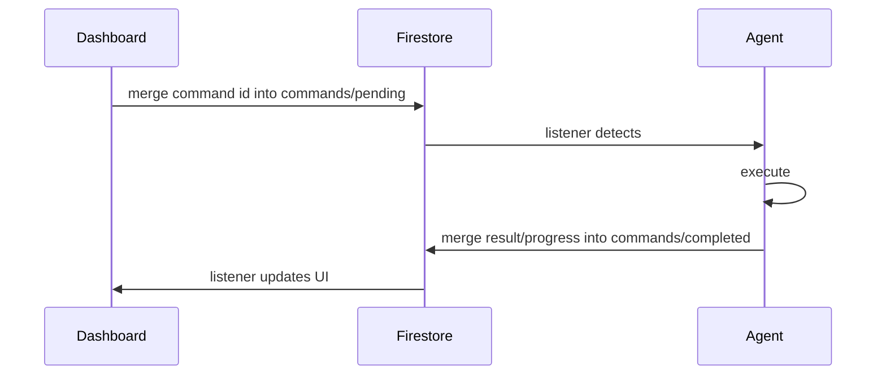

---

## command lifecycle



Each machine has two command documents:

- `sites/{siteId}/machines/{machineId}/commands/pending`
- `sites/{siteId}/machines/{machineId}/commands/completed`

Both documents store command IDs as top-level map fields. A successful terminal write removes the matching field from `pending`.

---

## command types

### process management

| command | description | data payload |
|---------|-------------|--------------|
| `restart_process` | Restart a configured process | `{process_name?, process_id?, processId?, timeout_seconds?}` |
| `start_process` | Start a configured process | `{process_name?, process_id?, processId?}` |
| `stop_process` | Stop a configured process | `{process_name?, process_id?, processId?}` |
| `kill_process` | Terminate a process | `{process_name?, process_id?, processId?}` |
| `set_launch_mode` | Set launch mode (`off`, `always`, or `scheduled`) | `{process_name?, process_id?, processId?, mode, schedules?}` |
| `toggle_autolaunch` | Legacy launch-mode toggle | `{process_name?, process_id?, processId?, autolaunch}` |

Every process command matches `process_id` / `processId` first and falls back to `process_name`. `set_launch_mode` persists the requested `mode` and any supplied `schedules`.

`restart_process` is served by the agent's command router (`agent/src/process_commands.py`) rather than the legacy dispatch branch. Its `timeout_seconds` is the graceful-terminate window before the running process is force-killed: it defaults to 5 seconds, must be `>= 0`, and is capped at 30. `POST /api/sites/{siteId}/machines/{machineId}/commands` stamps its own top-level `timeout_seconds` (default 60, max 600) into every payload it queues, so an API-queued restart hits the 30-second cap unless the request body sends a smaller value — a `timeout_seconds` placed inside `params` is dropped by the route. Restarting a process whose launch mode is `scheduled` outside its window records a manual override, the same as `start_process`.

### screenshots and live view

| command | description | data payload |
|---------|-------------|--------------|
| `capture_screenshot` | Capture desktop screenshot | `{monitor}` (0=all, 1=primary, etc.) |
| `start_live_view` | Start a repeating screenshot loop | `{interval?, duration?}` |
| `stop_live_view` | Stop the live-view loop | `{}` |

`capture_screenshot` is registered on the agent command router (`agent/src/machine_commands.py`), so it captures inside the active user's desktop session and uploads through the signed-URL flow rather than the legacy dispatch branch.

`start_live_view` clamps `interval` to 5-60 seconds (default 10) and `duration` to 60-1800 seconds (default 600), then sets the machine's `liveView` flag until the duration expires or `stop_live_view` arrives.

### configuration

| command | description | data payload |
|---------|-------------|--------------|
| `update_config` | Update process configuration from cloud | `{config}` |

### software deployment

| command | description | data payload |
|---------|-------------|--------------|
| `install_software` | Download, checksum, and install software | `{installer_url, sha256_checksum, installer_name?, silent_flags?, verify_path?, timeout_seconds?, deployment_id?, parallel_install?, close_processes?, suppress_projects?}` |
| `cancel_installation` | Cancel an in-progress installer process | `{installer_name}` |
| `uninstall_software` | Run a software uninstaller | `{software_name, uninstall_command, silent_flags?, installer_type?, verify_paths?, timeout_seconds?, deployment_id?}` |
| `cancel_uninstall` | Cancel an in-progress uninstall process | `{software_name}` |
| `refresh_software_inventory` | Force an immediate installed-software inventory sync | `{}` |

### project distribution

Current project distribution uses roost v2 handlers registered through the agent command router:

| command | description | data payload |
|---------|-------------|--------------|
| `sync_pull` | Fetch a roost version manifest, download required chunks, and assemble files at the target root | `{site_id, roost_id, version_id, version_url, extract_root}` |
| `cancel_sync` | Signal cancellation for an in-flight roost sync | `{site_id, roost_id, version_id}` |
| `rollback_to_version` | Pull an older roost version after the server-side rollback pointer changes | `{site_id, roost_id, version_id, version_url, extract_root}` |

The legacy v1 ZIP commands (`distribute_project`, `cancel_distribution`) were removed — the roost commands above are the only distribution path.

### system commands

| command | description | data payload |
|---------|-------------|--------------|
| `reboot_machine` | Reboot the machine after the agent announces a 30-second OS countdown | `{}` |
| `shutdown_machine` | Shut down the machine after the agent announces a 30-second OS countdown | `{}` |
| `cancel_reboot` | Abort a pending OS reboot/shutdown countdown | `{}` |
| `dismiss_reboot_pending` | Clear dashboard reboot-pending state | `{process_name?}` |
| `update_owlette` | Self-update the agent via a scheduled SYSTEM task | `{installer_url, checksum_sha256, target_version?, deployment_id?}` |

The agent does not provide a remote self-uninstall command. Remote software removal uses `uninstall_software` for third-party applications.

### display topology

| command | description | data payload |
|---------|-------------|--------------|
| `apply_display_topology` | Validate and apply a monitor layout, then arm the auto-revert watchdog | `{layout, applyId}` |
| `ack_display_topology` | Acknowledge an in-flight apply and cancel auto-revert | `{applyId}` |
| `enumerate_display_modes` | Build and upload the supported display-mode catalogue | `{}` |
| `test_display_apply` | Read-only helper smoke test — query plus validate against the live layout, never an apply | `{}` |

`apply_display_topology` and `ack_display_topology` also accept `apply_id` as an alias for `applyId`. The apply arms a 30-second revert watchdog: if no `ack_display_topology` carrying the same id arrives before the deadline, the agent restores the previous configuration. `enumerate_display_modes` writes to `sites/{siteId}/machines/{machineId}/hardware/displayModes` and skips the upload when the topology signature matches the last successful one.

### ai/hoot tools

| command | description | data payload |
|---------|-------------|--------------|
| `mcp_tool_call` | Execute a hoot tool | `{tool_name, tool_params, chat_id?}` |
| `cancel_mcp_tool` | Kill the process tree of an in-flight `mcp_tool_call` and mark it `cancelled` | `{target_command_id}` |
| `provision_cortex_key` | Encrypt and store the local hoot provider key in the agent's `config.json` | `{api_key, provider?}` |

`cancel_mcp_tool` is handled inside the agent's Firestore client rather than the service dispatch chain, and runs on the fast command lane so it can interrupt the call it targets. Cancelling is idempotent — an unknown or already-finished target returns a safe error. `provision_cortex_key` defaults `provider` to `anthropic`.

<Callout type="info" title={"hoot tool reference"}>

See the [hoot tools reference](/docs/reference/hoot-tools) for the canonical tool list with parameters, tiers, and allowed commands.

</Callout>
---

## command document structure

### pending command

Written as one field inside `sites/{siteId}/machines/{machineId}/commands/pending`:

```json
{
  "restart_process_machineA_1711234567890": {
    "type": "restart_process",
    "process_name": "TouchDesigner",
    "createdAt": "<server timestamp>",
    "expiresAt": "<timestamp>",
    "status": "pending"
  }
}
```

### completed command

Merged into `sites/{siteId}/machines/{machineId}/commands/completed`, then removed from `pending`:

```json
{
  "restart_process_machineA_1711234567890": {
    "type": "restart_process",
    "result": "Process TouchDesigner restarted (PID 4242 → 12345)",
    "status": "completed",
    "completedAt": "<server timestamp>"
  }
}
```

### failed command

```json
{
  "restart_process_machineA_1711234567890": {
    "type": "restart_process",
    "error": "Error: relaunch of TouchDesigner returned no PID",
    "status": "failed",
    "completedAt": "<server timestamp>"
  }
}
```

A record is written as `failed` only when the agent's result string starts with `Error:` — the agent's Firestore client decides completed-vs-failed on that prefix alone. Naming a process that is not in the machine's configuration is not an `Error:` string, so `restart_process`, `start_process`, `stop_process`, `kill_process`, `set_launch_mode`, and `toggle_autolaunch` all record `status: "completed"` with `result: "Process <name> not found in configuration"`. Consumers must inspect `result`, not `status` alone, to detect a bad process name. Genuine `restart_process` failures read `Error: invalid timeout_seconds value: ...`, `Error: timeout_seconds must be >= 0 ...`, `Error: failed to stop <name>: ...`, `Error: failed to relaunch <name>: ...`, or `Error: relaunch of <name> returned no PID`.

Progress updates are also merged into the completed document under the same command ID with fields such as `status`, `progress`, `deployment_id`, and `updatedAt`. Terminal states include `completed`, `failed`, and `cancelled`.

---

## command polling (dashboard)

When the web API queues a command, `POST /api/sites/{siteId}/machines/{machineId}/commands` accepts `type`, `params`, and optional `timeout_seconds`, then returns `202` with `{commandId, status: "pending"}`.

Poll `GET /api/sites/{siteId}/machines/{machineId}/commands/{commandId}` for the command result. The status route returns `pending`, `in_progress`, `completed`, `failed`, or a 404/timeout. hoot tool execution polls completion internally about every 1.5 seconds.

---

## software installation flow

The `install_software` command triggers a multi-step process:

```
1. Download installer to the agent temp installer directory.
   Progress: downloading 0% to 100%

2. Verify sha256_checksum.
   Missing or mismatched checksums fail the command before execution.

3. Optionally stop conflicting processes and suppress managed projects.
   Controlled by close_processes and suppress_projects.

4. Execute installer with silent flags in the interactive user's session.
   Progress: installing, then waiting for exit code.

5. Verify installation if verify_path is provided or derived from /DIR.

6. Cleanup temp file, release install locks, and sync software inventory.
```

### install_software payload

| field | required | default | notes |
|-------|----------|---------|-------|
| `installer_url` | yes | none | URL downloaded by the agent. |
| `sha256_checksum` | yes | none | Command is refused without this checksum. |
| `installer_name` | no | `installer.exe` | Used for the temp filename and process tracking. |
| `silent_flags` | no | empty string | Passed to the installer. `/DIR=...` can auto-fill `verify_path`. |
| `verify_path` | no | auto-derived from `/DIR` when possible | Checked after installer success. |
| `timeout_seconds` | no | `2400` | Installer timeout in seconds. |
| `deployment_id` | no | none | Included in progress records. |
| `parallel_install` | no | `false` | Temporarily hides matching registry keys during install. |
| `close_processes` | no | `[]` | Process names to terminate before install. |
| `suppress_projects` | no | `[]` | Managed project IDs to lock during install. |

### supported installer types

| type | silent flag | example |
|------|-------------|---------|
| **Inno Setup** | `/VERYSILENT /SUPPRESSMSGBOXES` | owlette itself |
| **NSIS** | `/S` | Notepad++ |
| **MSI** | `msiexec /i installer.msi /qn` | Windows Installer packages |
| **Custom** | Varies | Any executable with silent flags |

---

## project distribution flow

### roost v2 sync

The `sync_pull` command is the current distribution path:

```
1. Validate required site, roost, version, URL, and target-root fields.
2. Check the site-level roost kill switch.
3. Validate extract_root against the agent's destination allowlist.
   A path outside the allowed roots is refused here, before any download —
   the target state goes straight to failed with "destination refused".
4. Report the target state as pending.
5. Mint a fresh version download URL when the Firebase client can do so.
6. Fetch and validate the version manifest.
7. Diff against the most recent local committed version for that roost.
8. Register or resume a local distribution row.
9. Download missing chunks with throttled progress updates.
10. Assemble files atomically into extract_root.
11. Commit the distribution and report final target state.
```

`cancel_sync` looks up the matching in-flight distribution by `site_id`, `roost_id`, and `version_id`, then signals its cancellation event. `rollback_to_version` reuses the same `sync_pull` path; the server-side roost rollback has already selected the older version.

---

## system command details

### reboot / shutdown

Manual reboot and shutdown commands do not accept configurable countdown fields. The agent sets local shutdown intent, announces the state to Firestore, then invokes Windows with a fixed 30-second countdown:

```python
subprocess.run(['shutdown', '/r', '/t', '30', '/c', 'owlette remote reboot requested'])
subprocess.run(['shutdown', '/s', '/t', '30', '/c', 'owlette remote shutdown requested'])
```

`cancel_reboot` aborts the pending OS countdown with `shutdown /a` and clears the dashboard flags when Firestore is available.

### self-update

`update_owlette` requires `installer_url` and `checksum_sha256`. The agent derives `target_version` from the payload or URL, downloads the installer to `C:\ProgramData\owlette\tmp`, verifies the checksum, writes an update marker, and launches the installer through a one-time scheduled task running as SYSTEM. A recovery scheduled task attempts to restart the service if it does not return after the update.
